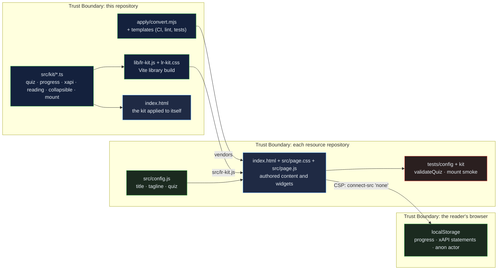

# Learning Resource Kit: the shared layer that turns ten authored pages into one consistent learning product

[](https://github.com/Freddricklogan/learning-resource-kit/actions/workflows/deploy.yml)
[](#5-getting-started--verification)
[](https://github.com/Freddricklogan/learning-resource-kit/actions/workflows/codeql.yml)
[](LICENSE)
[](https://freddricklogan.github.io/learning-resource-kit/)

## 1. Executive Summary & Business Impact

**Problem statement.** Ten graduate-level learning resources on this
profile — research methods, policy analysis, leadership, course design,
accessibility — were each a single hand-authored HTML file: rich content,
bespoke interactive widgets, no tests, no progress, no record of learning,
inline styles and scripts that no content-security policy would allow, and
no way to change all ten at once. Good teaching material, packaged in a way
an institution could not adopt.

**Solution & value delivered.** A typed TypeScript kit that each resource
vendors as one module and one stylesheet. It mounts the Executive Shell with
live KPIs, makes every section a keyboard-operable collapsible with progress
saved in the reader's browser, appends a five-question quiz whose answers
and completion are recorded as xAPI 1.0.3 statements, and adds a print
layout that opens everything. A converter (`apply/convert.mjs`) rewrites an
existing resource deterministically — styles and scripts out of the page,
custom properties namespaced, inline styles turned into classes, buttons
typed, tables given bodies, a `<main>` landmark added — and drops in CI,
lint, validation and tests so each resource is checked the same way. This
page is the kit applied to itself.

**[→ Read the full case study](docs/CASE_STUDY.md)**

| Outcome | How this repo delivers it |
| --- | --- |
| One behaviour across ten resources | `mountLearningResource(config)`: shell, progress, quiz, statements, print, from a config of title, tagline and questions |
| Learning evidence in a standard | `buildStatement()` emits xAPI 1.0.3 statements with ADL verb and activity IRIs and an anonymous actor; a capped local store keeps them inspectable |
| Nothing leaves the page | Every resource ships `default-src 'none'; connect-src 'none'`; the kit has no network code and storage degrades to memory when blocked |
| Malformed content fails CI | `validateQuiz()` runs against each resource's config in its own test suite |
| Conversion that can be audited | The converter writes `AUDIT.md` with counts of what it changed; the original stays in git history |

## 2. Demonstrated Competencies & Technical Skills

- **Systems Architecture & CS** — TypeScript strict with
  `noUncheckedIndexedAccess`; pure modules (quiz, progress, xAPI, reading)
  separated from the DOM layer; a Vite library build vendored by consumers;
  a deterministic converter with an audit trail.
- **EdTech & Human-Centered Design** — xAPI statements chosen per evidence
  type (experienced, answered, completed); one attempt per question with an
  explanation after; progress that reflects opening, not scrolling; a print
  layout for readers who annotate on paper.
- **Cybersecurity & Compliance** — strict CSP on every page, no inline
  handlers or styles, no third-party script, anonymous actor with no name or
  email; Trivy, npm audit and CodeQL in CI.
- **Data Science & AI** — reading-time and section indexing computed from
  content; scores and completion recorded as scaled results rather than
  claimed.

## 3. System Architecture & Data Flow



## 4. Technical Highlights & Engineering Decisions

### ADR-1 — Vendor a built module rather than publish a package

**Context.** Ten static repositories deploy from their root with no build
step; a package registry would add a build to each and a supply chain to
audit.

**Decision.** The kit builds one ES module (`lib/lr-kit.js`) and one
stylesheet; the converter copies both into a resource's `src/`. Each
resource's `tests/kit.test.js` mounts the vendored bundle against that
resource's real page, so a stale or broken copy fails in that repository.

**Consequence.** Resources stay dependency-free at runtime; updating them is
re-running the converter's copy step, not a version bump.

### ADR-2 — Record opening, not scrolling, and one attempt per question

**Context.** "Time on page" and scroll depth are easy to compute and say
little; a quiz that allows retries until correct records nothing about what
the reader knew.

**Decision.** A section counts as opened when its collapsed state is
removed; a question accepts its first answer only, then shows the
explanation. Statements use the ADL verbs that match: experienced for
opening, answered for each question, completed once with a scaled score.

**Consequence.** Numbers on the KPI strip are conservative and defensible;
a learning record store fed by these statements would receive evidence, not
activity.

### ADR-3 — Namespace the resource's custom properties in the converter

**Context.** The resources and the Executive Shell both define `--accent`,
`--muted`, `--panel` on `:root`; whichever stylesheet loads last would
recolour the other.

**Decision.** The converter reads every property declared on the page's
`:root` and rewrites `--name` to `--lr-name` in the extracted CSS and
JavaScript, including string literals such as `'var(--muted)'` that widget
code assigns at runtime.

**Consequence.** Both design systems coexist on one page with no edits to
the shell and no hand-editing of 26 property names per resource.

## 5. Getting Started & Verification

**Prerequisites.** Node 22, npm.

```bash
git clone https://github.com/Freddricklogan/learning-resource-kit.git
cd learning-resource-kit
npm ci
npm run check          # lint → typecheck → validate → test → build (site + lib)
npm run dev            # the demo page with hot reload

# apply the kit to a resource checkout (writes src/, tests/, CI, AUDIT.md; author src/config.js next)
node apply/convert.mjs ../qualitative-research-methods qualitative-research-methods
```

**Verification — the numbers this repository actually produced:**

```bash
npm run lint       # eslint (typed): 0 problems
npm run typecheck  # tsc --noEmit: clean
npm run validate   # html-validate index.html: clean
npm run coverage   # 31 passed; All files 99.03% stmts / 94.49% branches
npm run build      # site → dist/, library → lib/lr-kit.js (30.2 kB)
```

| Check | Result |
| --- | --- |
| Unit tests (Vitest, jsdom) | **31 passed / 31** across 7 files |
| Coverage (`src/kit`) | **99.03%** statements, **94.49%** branches |
| ESLint (typed), `tsc --noEmit`, html-validate | clean |
| Converter on `qualitative-research-methods` | 26 properties namespaced, 124 inline styles → 35 classes, 27 buttons typed, 6 tables fixed, `<main>` added; html-validate clean; 7 resource tests pass |
| Headless Chrome smoke (built demo) | **0 console errors**; KPIs update on open and answer; xAPI verbs experienced → answered → completed; four tour steps; no horizontal scroll at 1200 or 400 px |

## 6. Live Demo & Production Showcase

**<https://freddricklogan.github.io/learning-resource-kit/>** — the kit
applied to a short resource about the kit.

**30-second guided walkthrough.** Press **Take the 30-second tour**.

1. **A graduate-level resource, not a slide deck** — sections and reading
   time computed from the content.
2. **Open a section** — the KPI strip and an xAPI experienced statement
   update.
3. **Check your understanding** — one attempt, explanation, answered
   statement.
4. **Your statements, inspectable** — the JSON a learning record store would
   receive.

The ten resources that use the kit are linked from the profile README under
*Interactive Learning Resources*.
